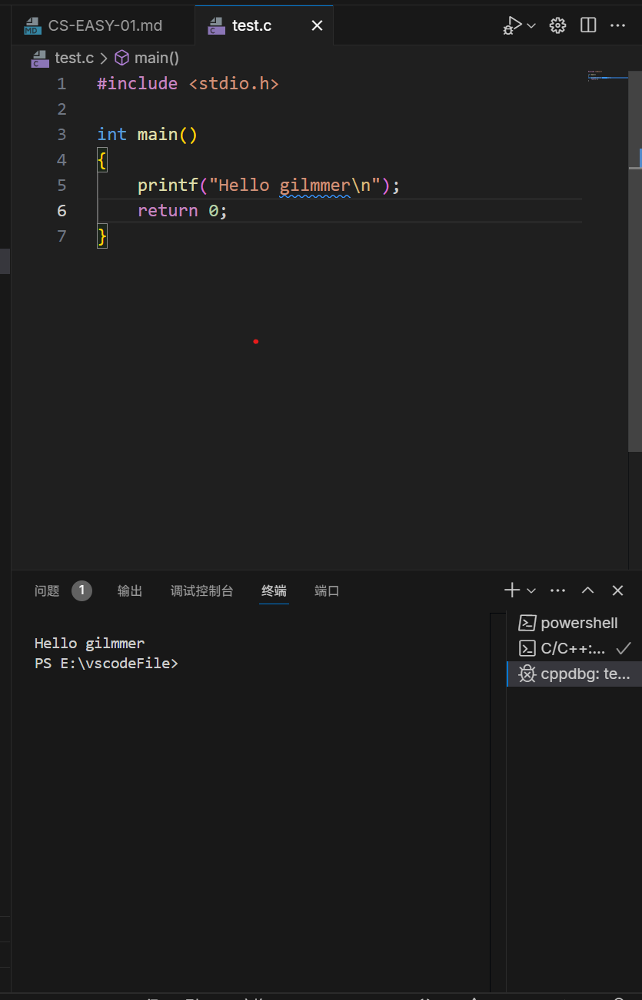

# 1,高级计算机语言与低级计算机语言，各有什么优劣，你更喜欢哪一类计算机语言？
---
## 低级计算机语言
低级计算机语言更偏向于计算机底层，形式上接近机器指令，语句中所对应的指令数相对较少，但对硬件的直接控制较强，执行的效率较高
## 高级计算机语言
高级计算机语言对低级语言进行了封装，一条语句对应的指令数更多，并且更加符合人的思维与自然语言，编写程序更加容易

**我更加喜欢高级语言，高级语言的可读性我个人认为明显高于低级语言（而且读起来更简洁易懂），同时编程技术的发展就是为了能让人们更方便快捷的进行复杂程序的编写，高级语言简化了程序的编写过程，编写的过程更加方便快捷，所以更加喜欢高级语言**

---
# 2,尝试解读hello.c中每一行的内容。
---
```cpp
#include <stdio.h>
```
"**#**" 表示头文件，相当于预处理指令，即提前加载好相关功能以便接下来程序执行时调用
**stdio** 为standard input output 的缩写，意味标准输入输出，输入即为接下来的程序，输出即为打印出来的“Hello，world！”
整行代码表示提前加载标准输入输出的库，为后续printf函数做提前准备

---
```cpp
int main()
{

}
```
main为c语言程序的入口点，即从main开始执行程序

{  }内为程序主体

---
```cpp
printf("Hello,world!");
```
printf为函数名，print format，即格式化打印
""内为字符串，即程序打印出来的东西

---
```cpp
return 0;
```
即返回，退出程序

---
# 3,删去该程序的哪一行不会影响运行结果？
删除return 0；不影响输出

---
# 4,int类型是计算机存储什么元素的方式？为什么main函数要使用int进行声明/定义？
int元素为整数类型元素
main()函数的返回值必须是整数类型，故只能用int定义

---
# 5,请调整上述程序的内容，使其输出内容改为Hello glimmer!并附上运行截图

